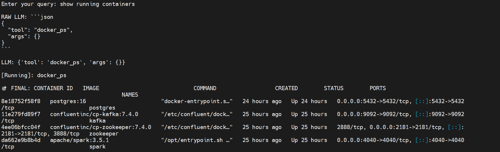
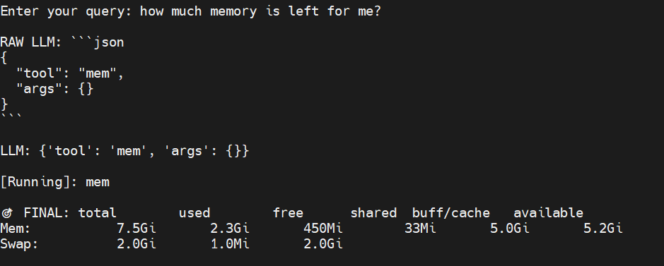

# Linux Command Agent (LLM-Based)

A lightweight AI-powered agent that converts natural language queries into Linux and Docker commands using a local LLM via Ollama.

---

## Features

- Natural language → Linux commands  
- Tool-based architecture for controlled execution  
- Docker support (containers, images, etc.)  
- Runs fully **locally using Ollama (no external API)**  
- Structured JSON output parsing from LLM  
- Modular design (LLM / parser / executor separation) 

---

## LLM Setup

This project uses **Ollama** to run a local language model.

---

### Example model:
You can change the model in `llm.py`.

### Run Ollama:

```
ollama run llama3
```
- Make sure Ollama is installed and running before starting the agent.

---

## Architecture
User Input  > LLM (Ollama - Tool Selection) > Parser (JSON → Tool) > Executor (Run Command) > Output

---

## Usage

```
python app.py

```
Enter your query: show running containers

## Example

```
RAW LLM: {"tool": "docker_ps"}
→ Running: docker ps
→ Output: ...
```

, 


## Project Structure
```
app.py        # Entry point
llm.py        # LLM interaction
parser.py     # JSON parsing
executor.py   # Command execution
tools.py      # Tool definitions
```
## Limitations
- Tool selection is not always accurate
- No multi-step reasoning yet
- Some queries return none (unsupported)
- No memory or learning system implemented
- Basic safety only (not production-ready)

## Status
This project is under active development.
It is a prototype and still being improved in terms of accuracy, safety, and capabilities.

## Future Improvements
- Improved intent detection
- Multi-step agent reasoning
- Logging and dataset generation
- Fine-tuning or RAG integration
- Enhanced command safety layer

# Installation
```
git clone https://github.com/your-username/linux-command-agent.git
cd linux-command-agent

pip install -r requirements.txt
```

## RUN
```
python app.py
```
